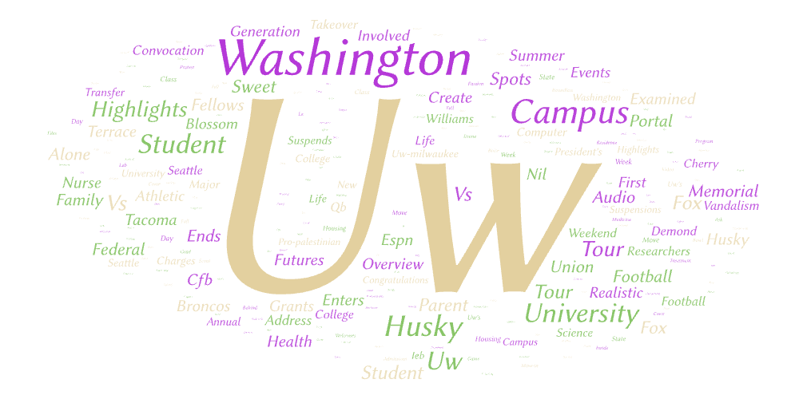
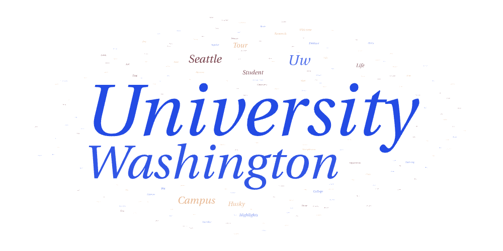
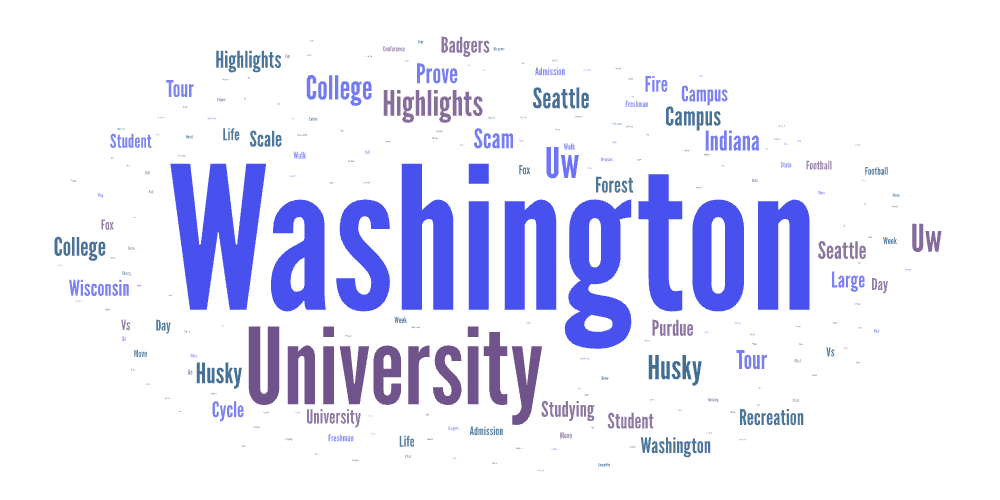

# Lab 2: Web Data Collection and Visualization (GEOG 458)

## Topic
This project explores how YouTube content related to the **University of Washington** varies depending on the search terms used. Although the three search terms examined all refer to the same institution, they may attract different audiences and types of content on YouTube.

## Search Parameters
The YouTube crawler was executed using the following three search terms:

- **uw**
- **uofwa**
- **university of washington**

For each search term, the crawler:
- accessed YouTube search results,
- scrolled multiple times to load additional videos,
- extracted video metadata including title, username, view count, creation time, and short descriptions,
- and exported the results into CSV files.

## Why This Comparison?
The comparison was made from the curiosty of an incoming freshman. When I was an incoming freshman I would be excited to view all things regarding the University of Washington. Hence I was curious to see what the three main search topics had to offer in differences for the University of Washington. These three terms were selected because they all reference the University of Washington but differ in formality and common usage.  

- **“uw”** is a casual abbreviation commonly used by students and alumni.
- **“uofwa”** is less commonly used and may reflect a smaller or more specific user group.
- **“university of washington”** is the full institutional name and is more likely used by official channels, news outlets, or prospective students.

Comparing these terms helps illustrate how language choice affects YouTube search results and the types of content surfaced.

---

## Word Cloud Results

### Search Term: uw

### Search Term: uofwa

### Search Term: university of washington

---

## Comparison of Word Clouds

### Similarities
Across all three word clouds, common terms related to campus life, students, and education appear frequently. This suggests that regardless of the search term, YouTube content about the University of Washington consistently centers on academic and campus-related themes.

### Differences
The **“uw”** word cloud contains more informal and student-centered language, reflecting personal videos such as vlogs, campus tours, and student experiences.  
The **“uofwa”** results are more limited, suggesting a smaller or less consistent content base for that term.  
The **“university of washington”** word cloud emphasizes more formal language and institutional references, indicating content from official university channels, news organizations, or informational videos.

## Possible Reasons for Observed Patterns
These patterns likely result from:
- different user groups using different search terms,
- YouTube’s recommendation and ranking algorithms,
- and the level of formality associated with each term.

More formal terms tend to surface official or informational content, while abbreviations are more closely associated with personal or student-generated videos.

## Unexpected Findings
Before conducting this analysis, I expected all three search terms to produce very similar results. However, the noticeable differences in language and content focus across the word clouds highlight how even small variations in search terms can significantly affect search outcomes.

## Future Improvements
This research could be improved by:
- increasing the number of scrolls to collect more videos,
- running the crawler at different times to account for temporal variation,
- cleaning text further by removing additional filler or platform-specific words,
- and expanding the study to include geographic comparisons or channel categories.

---

## Data Downloads
The collected datasets can be downloaded below:

- [uw search results](assets/uw.csv)
- [uofwa search results](assets/uofwa.csv)
- [university of washington search results](assets/university-of-washington.csv)
